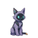
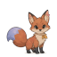
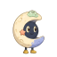
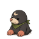
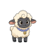

# Paket karakter resmi Peekling

Temui karakter kecil yang memberi Peekling kepribadiannya.

Ini adalah repositori resmi untuk paket karakter yang dibuat dan dikelola oleh proyek Peekling. Setiap paket menjelaskan penampilan, gerakan, reaksi, dan cara satu karakter memperkenalkan diri ke runtime Peekling yang kompatibel. Paket-paket ini bersifat open source, hanya berisi data, dan memiliki versi independen.

Kunjungi [Organisasi Peekling](https://github.com/peekling), atau baca [panduan pembuatan paket](../PACK-AUTHORING.md) untuk melihat bagaimana sebuah karakter disatukan.

## Apa itu paket karakter?

Paket karakter adalah kumpulan kecil data dan gambar. Paket ini tidak berisi kode yang menjalankan perilaku karakter.

Setiap paket resmi meliputi:

- manifes `character.json` yang memuat identitas, status, gerakan, versi, dan lisensi karakter
- atlas PNG 1x, 2x, dan 4x untuk kepadatan tampilan yang berbeda
- pratinjau `thumbnail.png`
- file `README.md`, `LICENSE`, dan `NOTICE` tersendiri

Manifes mencatat jalur gambar relatif yang aman dan hash SHA-256 untuk setiap atlas. Skrip pengembangan, pengujian, aset seni sumber, dan laporan QA yang dihasilkan tetap berada di repositori ini, di luar batas paket yang dipublikasikan.

## Peekling karakter

Tabel ini dibuat dari metadata paket saat ini dan data langsung dari registri npm. Baris yang sudah dipublikasikan tertaut ke versi npm yang telah diverifikasi. Paket yang masih hanya tersedia sebagai kode sumber tetap ditampilkan dengan label jelas `(belum dirilis)` dan tanpa tautan npm.

<!-- PACK_ROSTER_START -->
25 paket karakter diterbitkan dan dapat diinstal dari npm. 3 paket ditampilkan sebagai belum dirilis untuk tindak lanjut di masa mendatang.

| Pratinjau | Karakter | Deskripsi | Versi | Paket |
| :---: | --- | --- | --- | --- |
|  | [Bramble](../packages/pack-bramble) | Seekor beruang hutan yang hangat dengan kayu yang lambat dan meyakinkan. | `0.1.0` | [`@peekling/pack-bramble`](https://www.npmjs.com/package/@peekling/pack-bramble/v/0.1.0) |
|  | [Buns](../packages/pack-buns) | Teman burger bundar yang berguling ke depan dan duduk dengan lembut. | `0.1.0` | [`@peekling/pack-buns`](https://www.npmjs.com/package/@peekling/pack-buns/v/0.1.0) |
|  | [Byte](../packages/pack-byte) | Seekor kucing cyber yang cepat dengan pelindung cerah dan cakar yang tenang. | `0.1.0` | [`@peekling/pack-byte`](https://www.npmjs.com/package/@peekling/pack-byte/v/0.1.0) |
|  | [Crumb](../packages/pack-crumb) | Seorang teman seukuran roti panggang yang melompati tanpa menjatuhkan sedikit pun. | `0.1.0` | [`@peekling/pack-crumb`](https://www.npmjs.com/package/@peekling/pack-crumb/v/0.1.0) |
|  | [Ember](../packages/pack-ember) | Teman hutan berwarna merah karat dengan sifat cerah dan penuh petualangan. | `0.1.0` | [`@peekling/pack-ember`](https://www.npmjs.com/package/@peekling/pack-ember/v/0.1.0) |
|  | [Fable](../packages/pack-fable) | Seekor rubah terakota pintar selalu siap untuk jejak selanjutnya. | `0.1.0` | [`@peekling/pack-fable`](https://www.npmjs.com/package/@peekling/pack-fable/v/0.1.0) |
|  | [Glint](../packages/pack-glint) | Gumpalan unsur bercahaya melayang ke mana pun keajaiban mengarah. | `0.1.0` | [`@peekling/pack-glint`](https://www.npmjs.com/package/@peekling/pack-glint/v/0.1.0) |
|  | [Halo](../packages/pack-halo) | Sebuah planet bercincin kecil yang berputar melalui orbit terangnya sendiri. | `0.1.0` | [`@peekling/pack-halo`](https://www.npmjs.com/package/@peekling/pack-halo/v/0.1.0) |
|  | [Luna](../packages/pack-luna) | Teman bulan yang melamun menelusuri orbit kecil yang tenang. | `0.1.0` | [`@peekling/pack-luna`](https://www.npmjs.com/package/@peekling/pack-luna/v/0.1.0) |
|  | [Mochi](../packages/pack-mochi) | Kelinci bertelinga lavender dengan langkah lembut dan kenyal. | `0.1.0` | [`@peekling/pack-mochi`](https://www.npmjs.com/package/@peekling/pack-mochi/v/0.1.0) |
|  | [Moss](../packages/pack-moss) | Seekor katak hijau mint yang melintasi halaman dengan lompatan ceria. | `0.1.0` | [`@peekling/pack-moss`](https://www.npmjs.com/package/@peekling/pack-moss/v/0.1.0) |
|  | [Nib](../packages/pack-nib) | Seekor tikus tanah penasaran yang bersembunyi, berlari, dan muncul sambil tersenyum. | `0.1.0` | [`@peekling/pack-nib`](https://www.npmjs.com/package/@peekling/pack-nib/v/0.1.0) |
|  | [Nori](../packages/pack-nori) | Teman sushi yang nyaman dengan kocokan badan nasi yang lembut. | `0.1.0` | [`@peekling/pack-nori`](https://www.npmjs.com/package/@peekling/pack-nori/v/0.1.0) |
|  | [Nova](../packages/pack-nova) | Makhluk kosmik yang bergerak perlahan di antara dunia-dunia kecil. | `0.1.0` | [`@peekling/pack-nova`](https://www.npmjs.com/package/@peekling/pack-nova/v/0.1.0) |
|  | [Orbit](../packages/pack-orbit) | Robot kecil berbentuk bulat dengan tampilan keren dan langkah kecil yang presisi. | `0.1.0` | [`@peekling/pack-orbit`](https://www.npmjs.com/package/@peekling/pack-orbit/v/0.1.0) |
|  | [Peek](../packages/pack-peek) | Seekor anak kucing-rubah penasaran yang mengikuti petunjuk dan merayakan kemenangan kecil. | `0.1.0` | [`@peekling/pack-peek`](https://www.npmjs.com/package/@peekling/pack-peek/v/0.1.0) |
|  | [Pip](../packages/pack-pip) | Seekor corgi emas hangat yang berlari ke setiap perayaan kecil. | `0.1.0` | [`@peekling/pack-pip`](https://www.npmjs.com/package/@peekling/pack-pip/v/0.1.0) |
|  | [Purl](../packages/pack-purl) | Seekor domba berbulu yang berlari ke depan dengan kaki selembut awan. | `0.1.0` | [`@peekling/pack-purl`](https://www.npmjs.com/package/@peekling/pack-purl/v/0.1.0) |
|  | [Quill](../packages/pack-quill) | Burung hantu sarjana bijaksana yang terbang di antara ide-ide cemerlang. | `0.1.0` | [`@peekling/pack-quill`](https://www.npmjs.com/package/@peekling/pack-quill/v/0.1.0) |
|  | [Rivet](../packages/pack-rivet) | Kumbang jarum jam yang bergerak dengan tujuan yang cermat. | `0.1.0` | [`@peekling/pack-rivet`](https://www.npmjs.com/package/@peekling/pack-rivet/v/0.1.0) |
|  | [Rook](../packages/pack-rook) | Seekor rakun penasaran yang berjingkat menuju setiap kejutan yang mengilap. | `0.1.0` | [`@peekling/pack-rook`](https://www.npmjs.com/package/@peekling/pack-rook/v/0.1.0) |
|  | [Sol](../packages/pack-sol) | Seorang pendamping cerah yang mengapung dengan denyut nadi yang hangat dan bersinar. | `0.1.0` | [`@peekling/pack-sol`](https://www.npmjs.com/package/@peekling/pack-sol/v/0.1.0) |
|  | [Terra](../packages/pack-terra) | Bumi seukuran saku meluncur dengan putaran yang tenang dan mantap. | `0.1.0` | [`@peekling/pack-terra`](https://www.npmjs.com/package/@peekling/pack-terra/v/0.1.0) |
|  | [Tico](../packages/pack-tico) | Teman taco yang cerdas melangkah cepat tanpa menumpahkan apa pun. | `0.1.0` | [`@peekling/pack-tico`](https://www.npmjs.com/package/@peekling/pack-tico/v/0.1.0) |
|  | [Tumble](../packages/pack-tumble) | Pengembara kaktus ceria dengan kesombongan barat kecil. | `0.1.0` | [`@peekling/pack-tumble`](https://www.npmjs.com/package/@peekling/pack-tumble/v/0.1.0) |
|  | [Vali](../packages/pack-vali) | Slime kecil pemberani yang keberaniannya memenuhi ruangan. | `0.1.0` (belum dirilis) | `@peekling/pack-vali` (belum dirilis) |
|  | [Waddle](../packages/pack-waddle) | Seekor penguin berbalut syal dengan langkah lembut dari sisi ke sisi. | `0.1.0` (belum dirilis) | `@peekling/pack-waddle` (belum dirilis) |
|  | [Zesty](../packages/pack-zesty) | Sepotong pizza hidup yang meluncur dengan kemiringan penuh percaya diri. | `0.1.0` (belum dirilis) | `@peekling/pack-zesty` (belum dirilis) |
<!-- PACK_ROSTER_END -->

Jalankan `npm run roster` setelah mengubah metadata paket atau setelah rilis. `npm run roster:check` memverifikasi status publikasi npm dan menyimpan setiap paket yang belum dirilis diberi label dengan jelas.

## Menggunakan paket

Saat karakter muncul di tabel, buka tautan paketnya di npm untuk melihat versi terverifikasi yang dapat diinstal. Direktori sumber mendokumentasikan perintah validasi dan catatan lisensi, sedangkan `character.json` tetap menjadi rujukan utama untuk status, gerakan, aset seni, dan kemampuan karakter.

Hanya baris dengan tautan npm yang telah diverifikasi dapat diinstal. Baris `(belum dirilis)` menunjuk ke kode sumber di repositori untuk ditindaklanjuti dan bukan klaim bahwa paket sudah tersedia. Direktori sumber mungkin juga berisi perubahan yang lebih baru daripada versi di npm. Runtime Peekling terpisah dari paket karakter ini dan bertanggung jawab memuat manifes serta merender atlas yang dirujuk.

Ruang kerja di akar repositori bersifat privat dan tidak dapat dipublikasikan. Hanya ruang kerja individual `packages/pack-*` yang menjadi batas rilis.

## Buat karakter

Punya ide untuk teman kecil baru? Inti kreatif sebuah paket memiliki tiga bagian:

- `character.json` menjelaskan karakter, status animasinya, gerakan, versi, lisensi, dan file atlas.
- `atlas-1x.png` adalah atlas karya seni minimum dalam kontrak paket umum. Paket resmi juga harus menyertakan varian `atlas-2x.png` dan `atlas-4x.png` yang cocok.
- `thumbnail.png` adalah pratinjau kecil yang ditampilkan di galeri dan daftar paket.

Paket resmi yang dapat diterbitkan juga memerlukan `package.json`, `README.md`, `LICENSE`, `NOTICE`, dan setiap atlas diberi nama berdasarkan manifesnya. Mulailah dengan [panduan pembuatan paket](../PACK-AUTHORING.md) dan gunakan [Paket Peek](../packages/pack-peek) sebagai contoh sumber lengkap.

Tautan ke alat pembuatan lanjutan akan ditambahkan di sini setelah dirilis. Sampai saat itu, panduan pembuatan, manifes paket, dan paket resmi terkini menjadi rujukan utama.

##  Berkontribusi

Perbaikan yang bijaksana dan peningkatan yang terfokus dipersilakan. Jika Anda ingin mengusulkan karakter resmi baru atau perubahan yang lebih besar, silakan [membuka masalah](https://github.com/peekling/peekling-characters/issues) terlebih dahulu agar kita dapat menyepakati ruang lingkup, asal karya seni, dan perizinan.

Anda memerlukan Node.js 22 atau lebih baru. Ruang kerja mencatat npm 11.19.0 sebagai manajer paketnya.

1. Buka masalah untuk karakter baru sehingga namanya, tempatnya di koleksi resmi, kepemilikan karya seni, dan lisensinya dapat didiskusikan sebelum Anda melakukan banyak pekerjaan. Perubahan pada paket yang ada hanya diterima setelah pemilik kode atau peninjau yang ditunjuk menyetujuinya.
2. Fork dan clone repositori, lalu instal dependensi ruang kerja dengan `npm install`.
3. Pilih pengenal huruf kecil baru seperti `my-friend`. Itu tidak boleh menduplikasi direktori karakter, nama manifes, atau paket npm. Gunakan [Paket sumber lengkap Peek](../packages/pack-peek) sebagai contoh struktural dan buat `packages/pack-my-friend`.
4. Buat batas yang dapat dipublikasikan:

   - `package.json` menetapkan nama `@peekling/pack-my-friend`, versi semantik, akses publik, lisensi, direktori repositori, skrip build dan pengujian, serta daftar file publik yang tepat.
   - `character.json` menggunakan format 1 dan nama, versi, dan lisensi yang sama. Berikan judul, penulis, deskripsi, catatan atlas 1x/2x/4x, status animasi dengan bingkai dan pengaturan waktu yang valid, kedelapan arah gerakan, dan skala default positif.
   - `thumbnail.png` adalah 64x64 PNG yang valid. Kisi resmi saat ini menggunakan sel logis 64 piksel, 16 kolom, dan 3 baris, sehingga ketiga atlasnya adalah 1024x192, 2048x384, dan 4096x768. Kepadatan yang dinyatakan, ukuran sel, dimensi, dan hash SHA-256 harus sesuai.
   - Tambahkan `README.md`, `LICENSE`, `NOTICE`, pengujian terfokus, dan setiap atlas yang dirujuk oleh manifes. Simpan aset seni sumber dan alat bantu pengembangan di luar daftar `files`.
   - Untuk alur kerja seni manual saat ini, tambahkan karakter ke `scripts/build-character-roster.mjs` beserta metadata dan catatan gerakan yang diperlukan. Sediakan input sumber khusus repositori yang sama seperti paket lain agar `npm run build` dapat mereproduksi atlas, bukan menerima output yang diedit secara manual.

5. Jalankan pengujian dan pembuatan paket terfokus. Untuk Peek, perintah yang setara adalah:

   ```sh
   npm test -w @peekling/pack-peek
   npm run build -w @peekling/pack-peek
   ```

6. Jika metadata paket berubah, buat ulang tabel ini dengan `npm run roster`, lalu jalankan gerbang repositori lengkap dengan `npm run check`.
7. Jalankan `npm run changeset` dan sertakan setiap paket yang terpengaruh. Setiap perubahan file dalam direktori paket memerlukan keputusan versi, termasuk seni, JSON, metadata, dokumen, pengujian, dan file sumber. Pilih sendiri levelnya:

   - `patch` untuk perbaikan, koreksi, atau penyetelan yang kompatibel
   - `minor` untuk penambahan bermakna yang kompatibel dengan versi sebelumnya atau pembaruan materi iklan yang substansial
   - `major` untuk perubahan yang tidak kompatibel, penggantian, atau penghapusan

   Otomasi tidak pernah menebak level dari ukuran atau jenis perubahan Anda.

8. Buka pull request yang menjelaskan karakter, asal-usul dan lisensi aset seninya, apa yang berubah, serta alasan tingkat versi yang dipilih sudah sesuai.

Sebelum ditinjau, CI pull request memerlukan rencana rilis untuk setiap paket yang diubah. CI kemudian memeriksa kontrak manifes dan definisi status, keunikan pengenal, ketersediaan nama npm untuk paket baru, jalur gambar yang aman dan hash, integritas PNG, ukuran thumbnail, keberadaan atlas 1x/2x/4x dan geometri skala, pengujian, build yang dapat direproduksi, batas ukuran, lisensi, serta file yang tepat dalam setiap uji coba paket npm. Pemeriksaan ini mencegah konflik yang tidak disengaja dan kesalahan pengemasan. Peninjau tetap memutuskan apakah suatu karakter atau perubahan termasuk dalam koleksi resmi.

Setelah perubahan yang divalidasi mencapai `main`, Changesets menyiapkan permintaan penarikan versi terpisah untuk ditinjau. Publikasi npm pertama tetap merupakan tindakan pengelola yang disengaja. Publikasi OIDC otomatis dapat diaktifkan hanya setelah paket awal ada dan setiap paket memercayai alur kerja publikasi repositori ini. Hingga bootstrap selesai, sumber repositori bukanlah janji bahwa suatu paket tersedia dari npm. Lihat [persiapan rilis](../RELEASING.md) untuk alur pengelola selengkapnya.

Repositori ini adalah rumah pilihan untuk paket Peekling resmi, bukan katalog komunitas global. Pembuat konten dapat memublikasikan paket pihak ketiga yang kompatibel dari paket mereka sendiri atau batasan hosting statis dengan lisensi publik yang valid.

## Lisensi dan atribusi

Peralatan repositori, pengujian, dan dokumentasi dilisensikan berdasarkan [Apache-2.0](../LICENSE). Semua 28 paket karakter resmi saat ini juga menyatakan Apache-2.0 dan membawa file `LICENSE` dan `NOTICE` mereka sendiri.

Pendistribusian ulang harus mengikuti ketentuan lisensi dan pemberitahuan yang berlaku untuk setiap paket. Nama Peekling, logo, maskot resmi, dan identitas merek khas lainnya tidak diberikan oleh lisensi alat, kecuali lisensi aset tertentu menyatakan sebaliknya. Lihat [perizinan dan atribusi](../LICENSING.md), [NOTICE](../NOTICE), dan [AUTHORS](../AUTHORS) untuk catatan lengkapnya.

<p align="center">
  <a href="../README.md">🇺🇸</a> · <a href="README.es.md">🇪🇸</a> · <a href="README.zh-CN.md">🇨🇳</a> · <a href="README.ko.md">🇰🇷</a> · <a href="README.ja.md">🇯🇵</a> · <a href="README.nl.md">🇳🇱</a> · <a href="README.ar.md">🇸🇦</a> · <a href="README.vi.md">🇻🇳</a> · <a href="README.ru.md">🇷🇺</a> · <a href="README.fr.md">🇫🇷</a> · <a href="README.hi.md">🇮🇳</a> · <a href="README.pt-BR.md">🇧🇷</a> · <a href="README.de.md">🇩🇪</a> · <a href="README.it.md">🇮🇹</a> · <a href="README.id.md">🇮🇩</a> · <a href="README.tr.md">🇹🇷</a> · <a href="README.pl.md">🇵🇱</a> · <a href="README.bn.md">🇧🇩</a>
</p>


