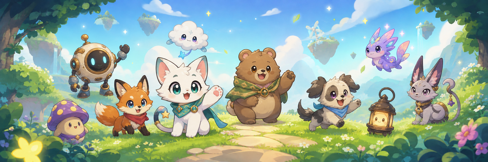

# 공식 Peekling 캐릭터 팩

Peekling에 개성을 부여하는 작은 캐릭터를 만나보세요.

Peekling 프로젝트에서 만들고 관리하는 캐릭터 팩의 공식 저장소입니다. 각 팩은 캐릭터의 모습과 움직임, 반응 방식, 그리고 호환되는 Peekling 런타임에 자신을 소개하는 방법을 설명합니다. 팩은 오픈 소스이며 데이터만 포함하고, 각각 독립적으로 버전을 관리합니다.

[Peekling 조직](https://github.com/peekling)을 방문하거나 [팩 제작 가이드](../PACK-AUTHORING.md)를 읽어 캐릭터가 어떻게 구성되어 있는지 확인하세요.

## 캐릭터 팩이란 무엇인가요?

캐릭터 팩은 데이터와 이미지로 구성된 작은 묶음입니다. 실행 가능한 캐릭터 동작은 포함하지 않습니다.

모든 공식 팩에는 다음이 포함됩니다:

- 캐릭터의 정체성, 상태, 움직임, 버전, 라이선스를 기록한 `character.json` 매니페스트
- 다양한 화면 밀도를 위한 1x, 2x, 4x PNG 아틀라스
- `thumbnail.png` 미리보기
- 자체 `README.md`, `LICENSE` 및 `NOTICE`

매니페스트는 모든 아틀라스에 대한 안전한 상대 이미지 경로와 SHA-256 해시를 기록합니다. 개발 스크립트, 테스트, 소스 아트 및 생성된 QA 보고서는 이 저장소에 유지되며 게시된 패키지 경계 외부에 있습니다.

## Peekling 캐릭터

이 테이블은 현재 패키지 메타데이터와 라이브 npm 레지스트리에서 생성됩니다. 게시된 행은 확인된 npm 버전에 대한 링크입니다. 여전히 소스 전용인 팩은 명시적인 `(미출시)` 라벨이 표시되고 npm 링크는 표시되지 않습니다.

<!-- PACK_ROSTER_START -->
25개의 캐릭터 팩이 게시되어 npm에서 설치할 수 있습니다. 3개의 팩은 추후 작업을 위해 미출시로 표시되어 있습니다.

| 미리보기 | 캐릭터 | 설명 | 버전 | 패키지 |
| :---: | --- | --- | --- | --- |
|  | [Bramble](../packages/pack-bramble) | 느리고 든든한 걸음으로 움직이는 따뜻한 숲속 곰. | `0.1.0` | [`@peekling/pack-bramble`](https://www.npmjs.com/package/@peekling/pack-bramble/v/0.1.0) |
|  | [Buns](../packages/pack-buns) | 앞으로 구르며 부드럽게 안착하는 둥근 버거 친구. | `0.1.0` | [`@peekling/pack-buns`](https://www.npmjs.com/package/@peekling/pack-buns/v/0.1.0) |
|  | [Byte](../packages/pack-byte) | 밝은 바이저와 조용한 발을 가진 민첩한 사이버 고양이입니다. | `0.1.0` | [`@peekling/pack-byte`](https://www.npmjs.com/package/@peekling/pack-byte/v/0.1.0) |
|  | [Crumb](../packages/pack-crumb) | 빵 부스러기 하나 흘리지 않고 깡충대는 토스트만 한 친구. | `0.1.0` | [`@peekling/pack-crumb`](https://www.npmjs.com/package/@peekling/pack-crumb/v/0.1.0) |
|  | [Ember](../packages/pack-ember) | 밝고 모험심이 강한 붉은색 숲속 친구입니다. | `0.1.0` | [`@peekling/pack-ember`](https://www.npmjs.com/package/@peekling/pack-ember/v/0.1.0) |
|  | [Fable](../packages/pack-fable) | 언제나 다음 길을 떠날 준비가 된 영리한 테라코타 여우. | `0.1.0` | [`@peekling/pack-fable`](https://www.npmjs.com/package/@peekling/pack-fable/v/0.1.0) |
|  | [Glint](../packages/pack-glint) | 경이로움이 이끄는 곳 어디든 떠도는 빛나는 정령 위습입니다. | `0.1.0` | [`@peekling/pack-glint`](https://www.npmjs.com/package/@peekling/pack-glint/v/0.1.0) |
|  | [Halo](../packages/pack-halo) | 자신의 밝은 궤도를 돌고 있는 작은 고리 행성입니다. | `0.1.0` | [`@peekling/pack-halo`](https://www.npmjs.com/package/@peekling/pack-halo/v/0.1.0) |
|  | [Luna](../packages/pack-luna) | 조용하고 작은 궤도를 따라가는 몽환적인 달 친구. | `0.1.0` | [`@peekling/pack-luna`](https://www.npmjs.com/package/@peekling/pack-luna/v/0.1.0) |
|  | [Mochi](../packages/pack-mochi) | 부드럽고 탄력 있는 발걸음을 내딛는 라벤더 귀 토끼. | `0.1.0` | [`@peekling/pack-mochi`](https://www.npmjs.com/package/@peekling/pack-mochi/v/0.1.0) |
|  | [Moss](../packages/pack-moss) | 쾌활한 홉으로 페이지를 가로지르는 민트색 개구리. | `0.1.0` | [`@peekling/pack-moss`](https://www.npmjs.com/package/@peekling/pack-moss/v/0.1.0) |
|  | [Nib](../packages/pack-nib) | 땅을 파고, 스치고, 웃으며 튀어나오는 호기심 많은 두더지. | `0.1.0` | [`@peekling/pack-nib`](https://www.npmjs.com/package/@peekling/pack-nib/v/0.1.0) |
|  | [Nori](../packages/pack-nori) | 밥으로 된 몸을 살며시 흔들며 걷는 포근한 초밥 친구. | `0.1.0` | [`@peekling/pack-nori`](https://www.npmjs.com/package/@peekling/pack-nori/v/0.1.0) |
|  | [Nova](../packages/pack-nova) | 작은 세계 사이를 부드럽게 이동하는 우주 생물입니다. | `0.1.0` | [`@peekling/pack-nova`](https://www.npmjs.com/package/@peekling/pack-nova/v/0.1.0) |
|  | [Orbit](../packages/pack-orbit) | 멋진 디스플레이와 정밀한 작은 발걸음을 갖춘 둥근 작은 로봇입니다. | `0.1.0` | [`@peekling/pack-orbit`](https://www.npmjs.com/package/@peekling/pack-orbit/v/0.1.0) |
|  | [Peek](../packages/pack-peek) | 포인터를 따라다니며 작은 성공을 축하하는 호기심 많은 고양이여우. | `0.1.0` | [`@peekling/pack-peek`](https://www.npmjs.com/package/@peekling/pack-peek/v/0.1.0) |
|  | [Pip](../packages/pack-pip) | 모든 작은 축하 행사에 참석하는 따뜻한 황금색 코기입니다. | `0.1.0` | [`@peekling/pack-pip`](https://www.npmjs.com/package/@peekling/pack-pip/v/0.1.0) |
|  | [Purl](../packages/pack-purl) | 구름처럼 부드러운 발로 질주하는 털북숭이 양. | `0.1.0` | [`@peekling/pack-purl`](https://www.npmjs.com/package/@peekling/pack-purl/v/0.1.0) |
|  | [Quill](../packages/pack-quill) | 기발한 아이디어 사이를 오가는 사려 깊은 학자 부엉이. | `0.1.0` | [`@peekling/pack-quill`](https://www.npmjs.com/package/@peekling/pack-quill/v/0.1.0) |
|  | [Rivet](../packages/pack-rivet) | 조심스럽게 목적을 갖고 기어다니는 태엽벌레. | `0.1.0` | [`@peekling/pack-rivet`](https://www.npmjs.com/package/@peekling/pack-rivet/v/0.1.0) |
|  | [Rook](../packages/pack-rook) | 반짝이는 놀라움을 향해 발끝으로 다가가는 호기심 많은 너구리. | `0.1.0` | [`@peekling/pack-rook`](https://www.npmjs.com/package/@peekling/pack-rook/v/0.1.0) |
|  | [Sol](../packages/pack-sol) | 따뜻하고 빛나는 맥박으로 떠다니는 햇살 가득한 동반자. | `0.1.0` | [`@peekling/pack-sol`](https://www.npmjs.com/package/@peekling/pack-sol/v/0.1.0) |
|  | [Terra](../packages/pack-terra) | 조용하고 꾸준한 회전으로 미끄러지는 주머니 크기의 지구. | `0.1.0` | [`@peekling/pack-terra`](https://www.npmjs.com/package/@peekling/pack-terra/v/0.1.0) |
|  | [Tico](../packages/pack-tico) | 아무것도 흘리지 않고 빠르게 발걸음을 옮기는 해맑은 타코 친구. | `0.1.0` | [`@peekling/pack-tico`](https://www.npmjs.com/package/@peekling/pack-tico/v/0.1.0) |
|  | [Tumble](../packages/pack-tumble) | 살짝 서부풍 멋을 뽐내는 쾌활한 선인장 방랑자. | `0.1.0` | [`@peekling/pack-tumble`](https://www.npmjs.com/package/@peekling/pack-tumble/v/0.1.0) |
|  | [Vali](../packages/pack-vali) | 통통 튀는 용기가 방을 가득 채우는 용감한 작은 슬라임입니다. | `0.1.0` (미출시) | `@peekling/pack-vali` (미출시) |
|  | [Waddle](../packages/pack-waddle) | 스카프를 두른 펭귄은 가볍게 좌우로 뒤뚱뒤뚱 걷는다. | `0.1.0` (미출시) | `@peekling/pack-waddle` (미출시) |
|  | [Zesty](../packages/pack-zesty) | 자신감 넘치는 기울기로 빠르게 움직이는 활기 넘치는 피자 조각. | `0.1.0` (미출시) | `@peekling/pack-zesty` (미출시) |
<!-- PACK_ROSTER_END -->

패키지 메타데이터를 변경하거나 릴리스한 뒤에는 `npm run roster`를 실행하세요. `npm run roster:check`는 npm 게시 상태를 확인하고 모든 미출시 패키지의 라벨을 명확하게 유지합니다.

## 팩 사용하기

표에서 캐릭터를 찾으면 패키지 링크를 따라 npm으로 이동해 검증된 설치 가능 버전을 확인하세요. 소스 디렉터리에는 검증 명령과 라이선스 기록이 문서화되어 있으며, `character.json`은 캐릭터의 상태, 움직임, 아트워크, 기능에 대한 단일 진실 공급원입니다.

npm 링크가 있는 행만 설치 가능하다고 검증되었습니다. `(미출시)` 행은 추후 작업을 위해 저장소의 소스를 가리킬 뿐, 사용할 수 있다는 뜻은 아닙니다. 소스 디렉터리에는 npm보다 최신 작업이 포함될 수도 있습니다. Peekling 런타임은 이러한 캐릭터 팩과 별개이며, 매니페스트를 불러와 참조된 아틀라스를 렌더링합니다.

저장소 루트의 작업공간은 비공개이므로 게시할 수 없습니다. 개별 `packages/pack-*` 작업공간만 릴리스 경계입니다.

## 캐릭터 만들기

새로운 작은 친구를 위한 아이디어가 있나요? 팩의 크리에이티브 핵심은 세 부분으로 구성됩니다.

- `character.json`는 캐릭터, 애니메이션 상태, 움직임, 버전, 라이센스 및 아틀라스 파일을 설명합니다.
- `atlas-1x.png`는 일반 팩 계약의 최소 아트워크 아틀라스입니다. 공식 팩에는 일치하는 `atlas-2x.png` 및 `atlas-4x.png` 변형도 포함되어야 합니다.
- `thumbnail.png`는 갤러리와 패키지 목록에 표시되는 작은 미리보기입니다.

공식 게시 가능 팩에는 `package.json`, `README.md`, `LICENSE`, `NOTICE` 및 매니페스트에 이름이 지정된 모든 아틀라스도 필요합니다. [팩 제작 가이드](../PACK-AUTHORING.md)로 시작하고 [Peek의 패키지](../packages/pack-peek)를 완전한 소스 예제로 사용하세요.

향상된 생성 도구가 출시되면 여기에 연결됩니다. 그때까지는 작성 가이드, 패키지 매니페스트 및 현재 공식 팩이 정보의 원천입니다.

## 기여하기

세심한 수정과 집중적인 개선을 환영합니다. 새로운 공식 캐릭터나 더 큰 변경을 제안하려면 먼저 [이슈를 열어](https://github.com/peekling/peekling-characters/issues) 범위, 아트워크 출처, 라이선스에 대해 합의해 주세요.

Node.js 22 이상이 필요합니다. 작업공간은 패키지 관리자로 npm 11.19.0을 기록합니다.

1. 새 캐릭터에 대한 이슈를 열어서 많은 작업을 수행하기 전에 이름, 공식 컬렉션에서의 위치, 작품 소유권 및 라이선스에 대해 논의할 수 있도록 하세요. 기존 팩에 대한 변경 사항은 해당 코드 소유자 또는 지정된 검토자가 승인한 후에만 허용됩니다.
2. 저장소를 포크하고 클론한 다음 `npm install`로 워크스페이스 의존성을 설치합니다.
3. `my-friend`와 같은 새로운 소문자 식별자를 선택하세요. 문자 디렉터리, 매니페스트 이름 또는 npm 패키지가 중복되어서는 안 됩니다. [Peek의 완전한 소스 패키지](../packages/pack-peek)를 구조적 예로 사용하여 `packages/pack-my-friend`을 생성합니다.
4. 게시 가능한 경계 구축:

   - `package.json` 이름 `@peekling/pack-my-friend`, 의미 체계 버전, 공개 액세스, 라이선스, 저장소 디렉터리, 빌드 및 테스트 스크립트, 정확한 공개 파일을 선언합니다.
   - `character.json`는 형식 1을 사용하며 동일한 이름, 버전 및 라이선스를 사용합니다. 제목, 작성자, 설명, 1x/2x/4x 아틀라스 레코드, 유효한 프레임과 타이밍이 포함된 애니메이션 상태, 8가지 이동 방향 모두, 양수 기본 배율을 지정합니다.
   - `thumbnail.png`은 유효한 64x64 PNG입니다. 현재 공식 그리드는 64픽셀 논리 셀, 16열, 3행을 사용하므로 세 개의 아틀라스는 1024x192, 2048x384 및 4096x768입니다. 선언된 밀도, 셀 크기, 차원 및 SHA-256 해시가 일치해야 합니다.
   -  `README.md`, `LICENSE`, `NOTICE`, 집중 테스트 및 매니페스트에서 참조하는 모든 아틀라스를 추가합니다. 소스 아트 및 개발 도우미를 `files` 목록 외부에 유지하세요.
   - 현재 수동 아트 파이프라인의 경우 필수 메타데이터 및 이동 기록과 함께 캐릭터를 `scripts/build-character-roster.mjs`에 추가합니다. 기존 팩에서 사용하는 것과 동일한 저장소 전용 소스 입력을 제공하여 `npm run build`에서 직접 편집한 출력을 허용하는 대신 아틀라스를 재현할 수 있습니다.

5. 집중 패키지 테스트를 실행하고 빌드합니다. Peek의 경우 해당 명령은 다음과 같습니다.

   ```sh
   npm test -w @peekling/pack-peek
   npm run build -w @peekling/pack-peek
   ```

6. 패키지 메타데이터가 변경된 경우 `npm run roster`로 이 테이블을 다시 생성한 다음 `npm run check`로 전체 저장소 게이트를 실행하세요.
7. `npm run changeset`을 실행하고 영향을 받는 모든 팩을 포함합니다. 팩 디렉터리 아래의 모든 파일 변경에는 아트, JSON, 메타데이터, 문서, 테스트 및 소스 파일을 포함한 버전 결정이 필요합니다. 레벨을 직접 선택하세요.

   - `patch` 호환 가능한 수정, 수정 또는 조정
   - `minor` 의미 있는 이전 버전과 호환되는 추가 사항 또는 실질적인 창의적 업데이트의 경우
   - `major` 주요 변경, 교체 또는 제거의 경우

   자동화는 변경사항의 크기나 종류를 기준으로 수준을 추측하지 않습니다.

8. 캐릭터의 특징, 아트워크 출처와 라이선스, 변경 내용, 선택한 버전 수준이 적절한 이유를 설명하는 풀 리퀘스트를 엽니다.

검토 전에 풀 리퀘스트 CI는 변경된 모든 팩의 릴리스 계획을 요구합니다. 이후 매니페스트 계약과 상태 정의, 식별자 고유성, 새 팩에 사용할 수 있는 npm 이름, 안전한 이미지 경로와 해시, PNG 무결성, 썸네일 크기, 1x/2x/4x 아틀라스의 존재 여부와 배율 관계, 테스트, 재현 가능한 빌드, 크기 제한, 라이선스, 각 npm 패키지 드라이런에 포함되는 정확한 파일을 검사합니다. 이 검사는 우발적인 충돌과 패키징 실수를 방지합니다. 캐릭터나 변경 사항이 공식 컬렉션에 속하는지는 여전히 사람이 검토해 결정합니다.

검증된 변경 사항이 `main`에 도달하면 Changesets는 검토를 위해 별도의 버전 풀 요청을 준비합니다. 첫 번째 npm 게시는 고의적인 유지 관리 작업으로 남아 있습니다. 자동 OIDC 게시는 초기 패키지가 존재하고 각 패키지가 이 저장소의 게시 작업 흐름을 신뢰한 후에만 활성화할 수 있습니다. 해당 부트스트랩이 완료될 때까지 저장소 소스는 npm에서 패키지를 사용할 수 있다는 약속이 아닙니다. 전체 관리자 흐름은 [출시 준비](../RELEASING.md)를 참조하세요.

이 저장소는 글로벌 커뮤니티 카탈로그가 아닌 공식 Peekling 팩을 선별한 홈입니다. 제작자는 유효한 공개 라이센스를 사용하여 자체 패키지 또는 정적 호스팅 경계에서 호환되는 타사 팩을 게시할 수 있습니다.

## 라이센스 및 귀속

저장소 도구, 테스트, 문서는 [Apache-2.0](../LICENSE)에 따라 라이선스가 부여됩니다. 현재 공식 캐릭터 팩 28개 모두 Apache-2.0을 선언하고 각자의 `LICENSE`와 `NOTICE` 파일을 갖고 있습니다.

재배포는 각 팩에 적용되는 라이센스 및 통지 조건을 따라야 합니다. Peekling 이름, 로고, 공식 마스코트 및 기타 독특한 브랜드 아이덴티티는 특정 자산 라이선스에 달리 명시되지 않는 한 도구 라이선스에 의해 부여되지 않습니다. 전체 기록은 [라이선스 및 귀속](../LICENSING.md), [NOTICE](../NOTICE) 및 [AUTHORS](../AUTHORS)를 참조하세요.

<p align="center">
  <a href="../README.md">🇺🇸</a> · <a href="README.es.md">🇪🇸</a> · <a href="README.zh-CN.md">🇨🇳</a> · <a href="README.ko.md">🇰🇷</a> · <a href="README.ja.md">🇯🇵</a> · <a href="README.nl.md">🇳🇱</a> · <a href="README.ar.md">🇸🇦</a> · <a href="README.vi.md">🇻🇳</a> · <a href="README.ru.md">🇷🇺</a> · <a href="README.fr.md">🇫🇷</a> · <a href="README.hi.md">🇮🇳</a> · <a href="README.pt-BR.md">🇧🇷</a> · <a href="README.de.md">🇩🇪</a> · <a href="README.it.md">🇮🇹</a> · <a href="README.id.md">🇮🇩</a> · <a href="README.tr.md">🇹🇷</a> · <a href="README.pl.md">🇵🇱</a> · <a href="README.bn.md">🇧🇩</a>
</p>


